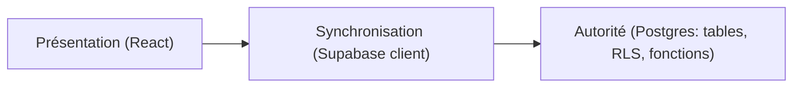
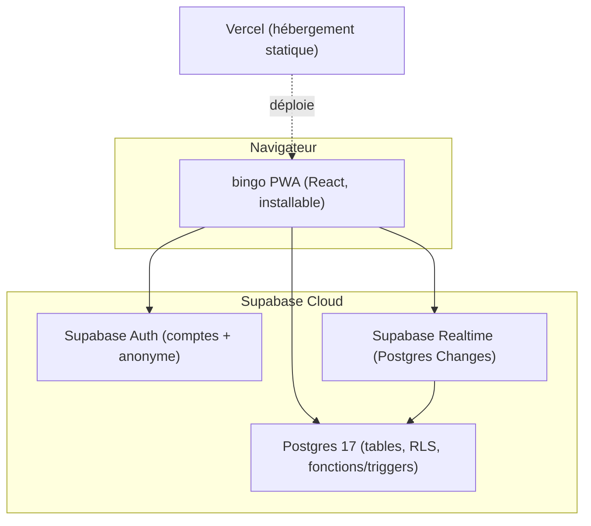
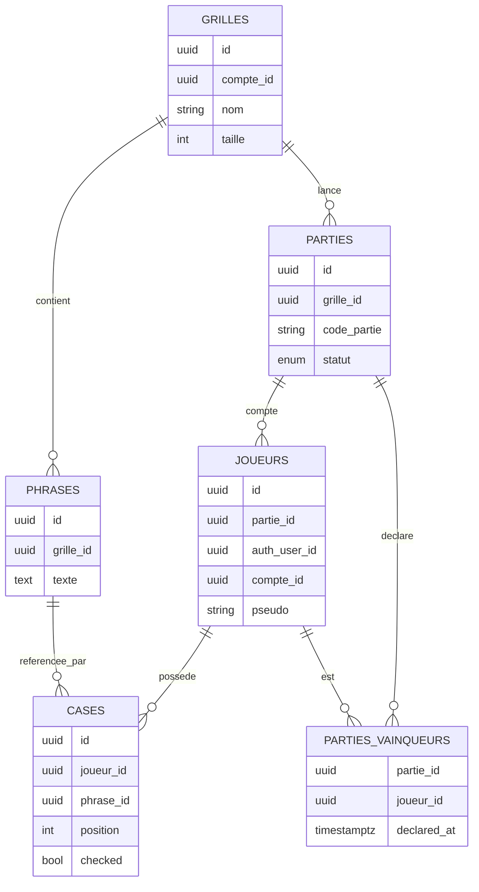

# Architecture Spine — bingo

## Design Paradigm

**Reactive BaaS : client fin, état faisant autorité côté serveur.** Le client React n'est jamais la source de vérité — il affiche et écrit son propre état, puis observe l'état partagé via abonnement temps réel. Toute règle qui doit produire le même résultat pour tous les joueurs (qui a gagné, si la partie est close) vit exclusivement côté Postgres/Supabase, jamais dupliquée côté client.

| Couche | Rôle | Où |
| --- | --- | --- |
| Présentation | Composants React, design system "carnet de fête" (`DESIGN.md`) | `src/features/*`, `src/components/` |
| Synchronisation | Requêtes + abonnements Supabase Realtime, un hook par entité | `src/lib/supabase/` |
| Autorité | Tables, politiques RLS, fonctions/triggers Postgres — seule source de vérité, seule à écrire les champs partagés (vainqueur, clôture) | `supabase/migrations/` |



La flèche ne remonte jamais : l'Autorité ne dépend jamais de la couche de présentation ni n'y contient de logique dupliquée.

## Invariants & Rules

### AD-1 — Backend Supabase [ADOPTED]

- **Binds:** toute persistance de données, synchronisation temps réel, authentification
- **Prevents:** construire à la main un serveur WebSocket, une couche d'auth et une logique de reconnexion pour un projet solo sans besoin de scale
- **Rule:** l'état faisant autorité vit dans Postgres (Supabase) ; la propagation temps réel passe par Supabase Realtime ; l'authentification (comptes et invités) passe par Supabase Auth.

### AD-2 — Frontend React + Vite + vite-plugin-pwa [ADOPTED]

- **Binds:** l'application cliente
- **Prevents:** un mélange de choix de framework entre features construites indépendamment
- **Rule:** PWA single-page, système de composants 100% sur-mesure (aucune librairie UI, cf. `EXPERIENCE.md.Foundation`), installable via le manifest/service worker de `vite-plugin-pwa`.

### AD-3 — Détection de victoire côté serveur [ADOPTED]

- **Binds:** FR-10, FR-11, FR-12
- **Prevents:** la divergence entre clients sur qui/quand un vainqueur est déclaré (course, détection manquée sur un client en retard réseau)
- **Rule:** une fonction/trigger Postgres, déclenchée à chaque écriture de cochage, calcule les lignes/colonnes/diagonales complètes et écrit le(s) vainqueur(s). Aucun client ne s'auto-déclare vainqueur ; chaque client écrit uniquement ses propres cases et observe l'état partagé via Realtime.

### AD-4 — Hébergement minimal, un seul environnement [ADOPTED]

- **Binds:** déploiement et environnements
- **Prevents:** une infra de production sur-dimensionnée pour un projet personnel sans besoin de scale (SM-C1)
- **Rule:** frontend statique sur Vercel, backend sur un unique projet Supabase Cloud. Un seul environnement (production) ; pas de staging, pas de multi-région.

### AD-5 — Identité des invités via l'auth anonyme Supabase [ADOPTED]

- **Binds:** FR-8, FR-15
- **Prevents:** un schéma de session/jeton invité fait main qui duplique ce que Supabase Auth fournit déjà
- **Rule:** tout Joueur (créateur ou invité) possède une identité Supabase Auth (anonyme ou persistante) ; la session est conservée côté client (stockage local du navigateur) et survit au rechargement/à la coupure réseau — aucun mécanisme de session invité séparé.

### AD-6 — Les Cases référencent une Phrase, ne la copient jamais [ADOPTED]

- **Binds:** FR-3, relation Case/Phrase
- **Prevents:** dénormaliser le texte de la phrase dans la Case au moment de la distribution, ce qui empêcherait une correction de texte (FR-3) d'atteindre les grilles déjà distribuées
- **Rule:** chaque Case stocke une clé étrangère vers la Phrase et sa position fixe dans la grille — jamais une copie du texte. Le texte est toujours lu par jointure ; une correction se propage automatiquement via les abonnements Realtime déjà en place.

### AD-7 — Realtime : Postgres Changes uniquement [ADOPTED]

- **Binds:** FR-3, FR-10 à FR-15
- **Prevents:** entretenir deux mécanismes temps réel parallèles (état en base + messagerie pub/sub) alors qu'il n'existe qu'une seule source de vérité
- **Rule:** toutes les mises à jour live de l'UI (case cochée, phrase corrigée, vainqueur déclaré, partie close, notifications transitoires) dérivent des abonnements Postgres Changes sur les tables `parties`, `cases`, `grilles`, `phrases` et `parties_vainqueurs` — pas de canal Broadcast séparé. Le vainqueur se lit exclusivement via l'abonnement à `parties_vainqueurs` (jamais un champ dérivé sur `parties`).

### AD-8 — Propriété d'écriture par ligne (RLS) [ADOPTED]

- **Binds:** toutes les tables du schéma applicatif
- **Prevents:** qu'un client puisse écrire un champ dont la cohérence dépend de tous les joueurs (ex. déclarer soi-même un vainqueur, clôturer une partie qui n'est pas la sienne, insérer sa propre ligne `cases` avec la position de son choix)
- **Rule:** un Joueur ne peut écrire (UPDATE) que le champ `checked` de ses propres lignes `cases`. Seul le Créateur peut écrire `grilles.nom`/`grilles.taille` (taille verrouillée après lancement, FR-5), `phrases.texte` (à tout moment, FR-3), et `parties.statut` (clôture, FR-13). Aucun client — créateur inclus — n'a de droit INSERT direct sur `joueurs`, `cases` ou `parties_vainqueurs` : ces trois tables ne sont écrites que par les fonctions serveur `SECURITY DEFINER` des AD-3 et AD-9.

### AD-9 — Rejoindre une partie et distribuer la grille sont une seule opération serveur [ADOPTED]

- **Binds:** FR-6, FR-8, FR-9
- **Prevents:** deux constructeurs indépendants qui diffèrent sur *quand* et *où* la distribution a lieu (en lot au lancement vs à la volée par joueur) — or FR-9 (le créateur rejoint après avoir lancé) et FR-8 (les invités rejoignent de façon asynchrone, jusqu'à 6) impliquent que le roster n'est jamais connu au lancement ; distribuer en lot casserait les arrivées tardives. Prévient aussi un client qui insérerait lui-même ses `cases` (aucune garantie serveur que deux joueurs de la même partie n'aient jamais la même disposition, FR-6) ou dépasserait le plafond de 6 joueurs (FR-8) par une course entre deux INSERT concurrents.
- **Rule:** une unique fonction Postgres `SECURITY DEFINER` (`rejoindre_partie`) gère l'arrivée d'un Joueur (créateur ou invité) : elle vérifie atomiquement le plafond de 6 joueurs, insère la ligne `joueurs`, puis génère et insère les lignes `cases` de ce joueur (position + `phrase_id` mélangés aléatoirement parmi le pool de `phrases` de la grille). Le client n'appelle que cette fonction ; il n'insère jamais lui-même dans `joueurs` ou `cases`.

### AD-10 — Reconnexion : recharger avant de réabonner [ADOPTED]

- **Binds:** FR-15
- **Prevents:** deux constructeurs qui divergent sur la stratégie de reconnexion — l'un se contente de réabonner Realtime (qui ne rejoue pas les événements manqués pendant la coupure, perdant cases cochées/vainqueur annoncé hors-ligne), l'autre récupère l'état complet avant de réabonner. Sans cette règle, FR-15 ("aucune perte de progression") n'est garanti par aucun des deux chemins.
- **Rule:** à chaque (re)montage de l'écran Grille en direct (ouverture, retour de coupure réseau), le client effectue d'abord une requête complète de l'état courant (`parties`, ses propres `cases`, `parties_vainqueurs`) puis ouvre/rouvre l'abonnement Realtime — jamais l'inverse, jamais un abonnement seul.

## Consistency Conventions

| Concern | Convention |
| --- | --- |
| Naming (entities, files, interfaces, events) | Tables/entités en français, alignées sur le glossaire PRD : `grilles`, `phrases`, `parties`, `joueurs`, `cases`, `parties_vainqueurs`. Dossiers de features nommés d'après l'IA de `EXPERIENCE.md` (`bibliotheque`, `creation-grille`, `rejoindre-partie`, `grille-en-direct`, `auth`). |
| Data & formats (ids, dates, error shapes, envelopes) | Ids `uuid` (défaut Supabase). Timestamps `timestamptz`. `parties.statut` en enum Postgres (`en_cours`, `terminee`). Co-vainqueurs modélisés par une table de jonction `parties_vainqueurs` (partie_id, joueur_id, declared_at), jamais un champ singulier. |
| State & cross-cutting (mutation, errors, logging, config, auth) | RLS activée sur toutes les tables (voir AD-8). Aucune clé secrète dans le bundle client — le navigateur n'utilise que la clé publique contrainte par RLS (nouvelle nomenclature Supabase `publishable`/`secret`, qui remplace `anon`/`service_role` fin 2026 — utiliser `publishable` dès le départ). Les fonctions `SECURITY DEFINER` (AD-3, AD-9) écrivent au-delà des droits du joueur qui les appelle. |

## Stack

| Name | Version |
| --- | --- |
| React | 19.2.7 |
| Vite | 8.1.3 |
| vite-plugin-pwa | 1.3.0 |
| @supabase/supabase-js | 2.110.0 |
| Postgres (géré par Supabase) | 17 |
| Hébergement frontend | Vercel |
| Plateforme backend | Supabase Cloud |

## Structural Seed





```text
bingo/
  src/
    features/
      bibliotheque/         # Bibliothèque de grilles (FR-16, FR-17)
      creation-grille/       # Création et gestion de grille (FR-1 à FR-4)
      rejoindre-partie/       # Rejoindre une partie (FR-8)
      grille-en-direct/       # Jeu temps réel (FR-6, FR-9 à FR-15)
      auth/                    # Connexion / Compte (FR-16)
    lib/
      supabase/                # client Supabase, un hook de requête + abonnement par entité
    components/                # composants UI partagés (design system "carnet de fête")
  supabase/
    migrations/                 # schéma SQL, politiques RLS, fonctions/triggers (AD-3, AD-8)
```

## Deferred

- **Historique/statistiques des parties** — hors scope v1 (PRD §6.2), piste explicitement notée pour une suite éventuelle.
- **Mode spectateur, chat intégré** — hors scope v1 (PRD §6.2).
- **Notifications push** — hors scope v1 (PRD §6.2) ; reconsidérer seulement si l'usage réel (SM-1) en montre le besoin.
- **Staging / multi-région / scaling infra** — délibérément non traité (AD-4, SM-C1) : projet personnel sans ambition de croissance.
- **Protection anti-abus au-delà des défauts Supabase** — délibérément non traité ; usage entre proches de confiance, pas d'exposition publique large.
- **Grilles non carrées, nouvelles conditions de victoire** — hors scope v1 (PRD §6.2).
- **Thèmes de phrases suggérés** — piste future notée au Brief (§Vision) et au PRD (§6.2, note PM) ; non traité en v1.
